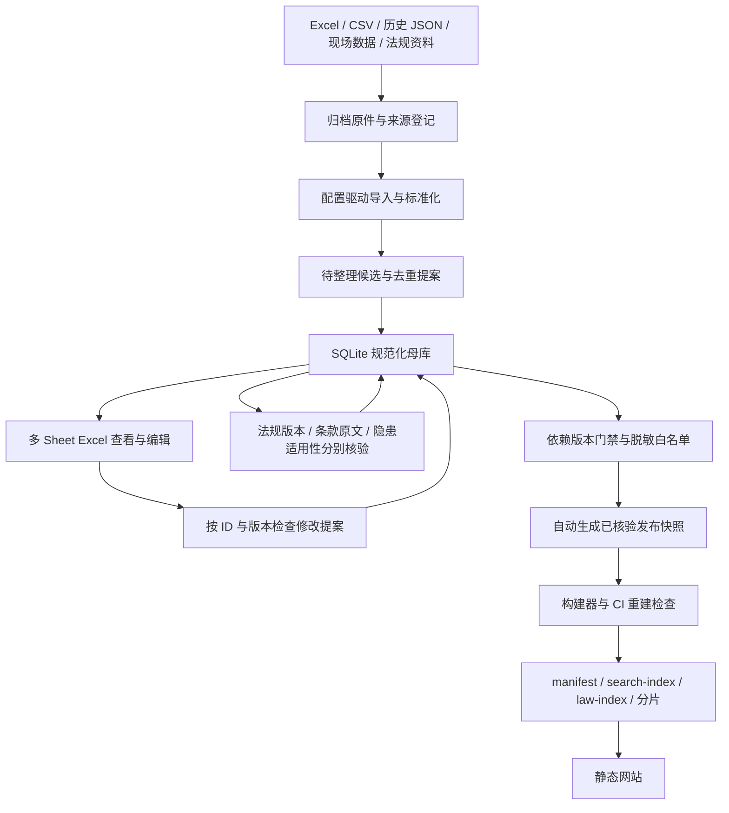

# Safety Basis 数据架构 V3：第一阶段设计与验证

设计日期：2026-09-08。工作分支：`data-verify-batch-003`。
检查基线：`b95ace0d5953f1375613294835b626a9f55cbf4c`。
本阶段不开展法规原文终审，不将候选升级为已核验，不切换 main 或部署。

后续进展：第二阶段第1步“正式母库与无损迁移”已落地，见 [MASTER_MIGRATION.md](MASTER_MIGRATION.md)。以下保留第一阶段设计及当时实施边界，Excel 双向维护和严格发布器仍待后续实现。

## 1. 决策摘要

保留静态网站和 V2 前端契约，建设独立的数据工作台流水线。
采用 **SQLite 规范化母库 + 多 Sheet Excel 编辑交换 + 已核验发布快照 + 原网站构建器**。
SQLite 是唯一正式数据状态，Excel 是主要人工查看、编辑入口；用户无需编辑任何 JSON。
Python 负责导入、事务、差异、核验记录；现有 Node 构建器继续负责静态索引和分片。
不需要在线数据库服务器，也不需要给网站增加后台才能扩容。

选择 SQLite 的原因：外键、唯一键、事务和版本冲突检查更可靠；Excel 无法安全承担多个 AI 同时写入、复杂引用约束和历史版本管理。
工作簿不是第二份独立母库。每次导出附母库 revision，回收时按 ID 和行 revision 生成修改提案，检查后一次事务提交。
数据库、本地 Excel、原始资料均放本地受控目录；Git 存程序、配置、脱敏发布快照及审核过的知识备份。
母库与原件必须有独立备份，`.gitignore` 不是备份。正式启用前落实 SQLite backup API 快照、文件清单 SHA256、至少一份异地私有副本及恢复演练。



## 2. 已检查的现状

| 对象 | 当前分支事实 | 架构含义 |
| --- | --- | --- |
| `content/` + 7 个 batch 文件 | 81 隐患、29 法规、80 条款、93 关联 | 已有规范化基础，无需推倒重建 |
| H001–H032 | 32 条标记已核验 | 这是继承状态，本次没有重新法律终审 |
| H033–H081 / Batch 003 | 49 条待核验，关联 49 条候选条款 | 保留待核验和全部草稿，不自动升级 |
| 当前构建结果 | 32 隐患、19 法规、31 条款、44 关联 | 现有门禁能拦截 Batch 003 |
| 法规索引 | 可独立包含“即将生效”且有日期/链接的法规 | 新严格发布策略应单独核验，不能当成现行隐患依据 |
| `js/store.js` | 强制要求运行 schemaVersion=2，按分片加载 | 母库 schemaVersion=3 与网站运行 schemaVersion=2 分开 |
| 导出维护源按钮 | 只取 5 个基础 JSON，漏掉 batch 数据 | 不能用这个导出包充当完整备份 |
| data 分支 CI | 每次 push 重跑纠偏和 hold 脚本，再自动提交 | 会覆盖后续核验状态；迁移前必须停用常态自动改写 |
| hold 脚本 | 向 note 追加交接说明 | 不可当作永久状态管理器重复运行 |

现有状态页使用 health.pendingHazards/pendingLaws（公开统计），未展示 stagedHazards/stagedLaws 的母库待核规模；迁移时应区分公开与待核，不能把公开待核为0显示成“全库均已完成”。

实时查看线上数据状态页显示 81 隐患（32 已核验）、28 法规、80 条款、93 关联，待核隐患 49。
这与当前分支重建的公开数据不同；不能据此声称线上门禁已经生效。本次只记录差异，不改 main。
上线验收必须检查实际线上 manifest 和全部索引/分片，不能只看 CI 绿灯或相同 dataVersion。

当前工作区及仓库没有提供 `隐患库汇总_样表2_ZCode.xlsx`；本轮未核实其实际行数和表头。
2776 只是用户提供的来源规模，不能写入模型容量、ID 逻辑或验收硬编码。真实 Excel 验收留在来源文件到位后。

## 3. 目录与数据权威

| 路径 | 职责 | 是否入公开 Git |
| --- | --- | --- |
| `source/imports/` | 任意多个待导入文件 | 否 |
| `source/archive/<sha256>/original` | 原始字节不可变，登记所有文件名与来源位置 | 否 |
| `source/staging/intake.sqlite3` | 原始行、解析批次、错误、候选和候选来源 | 否 |
| `source/master/safety.sqlite3` | 正式规范化母库，允许待整理/待核验/已失效 | 否 |
| `source/exchange/` | Excel 工作副本、回收差异和冲突报告 | 否 |
| `source/proposals/` | 模型待合并结果，按 job ID 隔离 | 否 |
| `source/mappings/` | 字段别名、表头行、Sheet、JSON 路径、解析版本 | 是 |
| `source/schemas/` | 母库迁移 DDL、交换契约和字典 | 是 |
| `source/releases/<releaseId>/` | 自动生成、仅已核验且脱敏的公开快照 | 是，启用正式发布器后 |
| `content/` | 迁移期原始规范化输入及 batch 历史 | 暂保留，切换后冻结归档 |
| `data/` | 网站 JSON、索引和分片，全部派生 | 是 |
| `tools/pipeline/` | Python 导入/整理/校验/发布命令 | 是 |
| `tools/build-data.mjs` | V2 运行格式编译器 | 是，后续增加 release 输入适配器 |

发布只打包网站文件和 `data/` 到 `dist/`，禁止部署仓库根目录中的母库、草稿和原件。
公开仓库不能保护被提交进去的待核验资料；迁移后的内部工作必须保存在本地或私有存储。

## 4. 规范化母库实体

所有实体均有稳定 ID、revision、createdAt、updatedAt；核验和合并记录追加保存，不用覆盖删除代替历史。
下表是正式母库设计；本阶段仅 staging 子集已有可执行 DDL。

| 表 | 关键字段与约束 |
| --- | --- |
| `hazards` | id、title、description、measures、category、conditions、mode、status、revision、mergedInto；不存法规原文 |
| `hazard_tags` | hazardId、kind、value；联合唯一，存 aliases/places/keywords，避免分隔符歧义 |
| `laws` | id、canonicalName、issuer、jurisdictionCode、documentKind、identityKey；同一法规身份只一条 |
| `law_aliases` | lawId、alias；别名只做查找，不直接作为唯一身份 |
| `law_versions` | id、lawId、versionKey、documentNumber、officialName、level、scope、effectiveDate、endDate、validityStatus、reviewStatus、sourceUrl、revision；(lawId, versionKey) 唯一 |
| `law_successions` | oldVersionId、newVersionId、relation、scope、effectiveDate、verificationId；支持部分替代和一对多替代 |
| `clauses` | id、lawVersionId、articlePath、quote、sourceUrl、status、revision；(lawVersionId, articlePath) 唯一 |
| `links` | id、hazardId、clauseId、role、priority、applicability、jurisdictionCode、status、revision；(hazardId, clauseId) 唯一 |
| `sources` | id、sha256、originalName/别名、mediaType、visibility、storageRef、来源日期、获取日期；内容哈希唯一 |
| `source_rows` | id、sourceId、sheet、rowNumber/JSON 路径、rawPayload；一个来源行可拆出多个隐患 |
| `provenance` | id、entityType、entityId、sourceRowId、fieldPath、transformRunId；多对多，保留一个条目的全部来源 |
| `verification` | id、entityType、entityId、entityRevision、dependencyHash、checkType、result、reviewer、model、checkedAt、reviewDueAt、evidenceId、reason、supersedes；必须指向存在的对象和版本 |
| `evidence` | id、officialUrl、retrievedAt、snapshotRef、sha256、page/locator；核验报告引用证据，不复制到每条隐患 |
| `merge_decisions` | id、sourceIds、targetIds、action、baseRevision、reason、reviewer、createdAt；保留合并/拆分/排除历史 |
| `dictionary` | kind、code、label、parentCode、active；主题、区域、状态、依据角色和适用类型 |
| `change_sets` | id、baseRevision、resultRevision、actor、diffHash、createdAt；Excel/AI 更新事务审计 |

`laws` 是法规身份，`law_versions` 是各版正式文件。不同年份版本应保留，不属于冗余。
不能把旧条款原文仅改个标准号：新版本建立新版本行和新条款，原版本保留。
旧站 Lxxx 迁移成对应版本的稳定运行 ID，新增法规身份使用 LF_ 前缀。旧 Cxxx/Hxxx 全部保留。
旧版/新版条文即使同为“第六条”也分别属于不同版本；同一版同一条只存一次，差异原文进入冲突队列。
江苏/南京按独立区域码和版本记录管理；国家与地方有补充关系，不能自动“地方覆盖国家”。

## 5. Excel 如何组织

一个 `safety-master.xlsx` 用于主要人工维护，多 Sheet 按实体拆分。
不用大表重复法规原文。原始数千行仍在各自文件和 staging，不搬进隐患库冒充整理结果。

| Sheet | 一行代表 | 人工操作 |
| --- | --- | --- |
| 隐患库 | 一个可复用隐患概念 | 描述、整改、分类、状态提案 |
| 法规库 | 一个法规身份 | 名称、别名、机关、地区 |
| 法规版本 | 一份版本文件 | 文号、版本、效力、生效失效日期、来源 |
| 条款库 | 某版本一个条/款/项 | 条款定位和原文 |
| 依据关联 | 隐患与条款一对关系 | 依据角色、条件、优先级、适用性核验 |
| 隐患标签 | 一条标签 | 别名、场所、关键词，避免分隔符冲突 |
| 原始来源 | 一个来源文件 | 可读名称与授权可见定位，不重复文件正文 |
| 来源关联 | 一个来源行与一个实体的关联 | 从隐患回到文件、Sheet、行号 |
| 核验记录 | 一次指定版本的核验 | 提交核验结果、日期、证据和理由 |
| 合并记录 | 一次合并/拆分/排除决定 | 保留旧 ID 和去向 |
| 字典 | 一个枚举值 | 稳定 code，显示中文 label |
| 说明 | 交换批次元数据 | schemaVersion、baseRevision、导出时间、使用方法 |

统一约束：首行固定字段名、冻结表头、筛选、ID 文本格式、日期 ISO、状态下拉。
每个实体 Sheet 带 id、revision、operation。可编辑列与只读列有样式区分，保护单元格仅辅助提示，导入端必须再次验证。
空 ID 新行用临时 ref 关联；确认事务由程序一次分配正式 ID 并回填，不靠 Excel 行号或人工数编号。
排序不影响关联。删除行不代表删除数据：删除/合并必须用明确 operation + reason。
读回 Excel 先生成差异，拒绝重复 ID、外键断链、旧 revision、非法状态、公式、未经核验的“已核验”标记。
仅改变状态单元格不能发布；核验记录、对象版本、依赖版本和证据必须匹配。
多名 AI 各自输出提案，主提交器串行落库，不共享写同一 Excel/SQLite。

## 6. 多来源导入契约

1. 先计算文件 SHA256，存原件，登记源路径和来源类型。文件改名不重复入库；同名内容变化是新版本来源。
2. 配置选择 Sheet、表头行和字段别名；CSV 可选编码/分隔符；旧 JSON 可选 recordsKey。
3. 每行保留原值、来源定位。标准化只处理 Unicode/多余空白，不删除否定词、数字、单位、版本或条号。
4. 标题/隐患描述无法唯一识别时失败并生成错误；不得猜字段、悄悄丢行或把首列机械当隐患。
5. 候选默认 `待整理`，原文件写“已核验”也不能赋予系统核验状态。合规检查项目不自动反写成缺陷。
6. `importRunId = hash(fileSHA + extension + parserVersion + canonicalMapping)`，相同输入重复导入幂等。
7. 文件读取使用同一份字节做哈希、归档和解析。导入事务完整成功才产生候选；失败仍保留原件及已读取原始行。
8. 不认识的新布局新增 mapping，不为每个 Excel 重写程序。复杂合并表头、扫描件和多条隐患混在一格由专门适配器产出候选提案。

第一阶段原型支持一份配置处理多个同布局文件；不同布局分别指定配置。
原型只要求可识别标题，其余缺失可以保存在待整理候选；这不表示已达到正式隐患完整性标准。JSON 来源当前用 recordsKey、原文件、序号组合定位，第二阶段统一导出 JSON Pointer。
第二阶段添加配置注册表自动选择：仅唯一匹配才自动导入；无匹配或多个匹配时输出映射待办。
多 Sheet 默认全读，非数据说明页应显式指定目标 Sheet；空表和异常字段会被报告，不静默忽略。

## 7. 去重、合并和 ID

三层去重：

* 文件层：SHA256，重命名重复也登记新的路径别名。
* 候选层：全部已映射语义字段（除外部行编号）规范化哈希完全一致才自动聚合候选；每个原始行保留。
* 知识层：标题/关键词召回候选，再比较缺陷、对象、条件、地区、义务和措施。相似度只提出建议，不能据标题相似自动合并。

候选聚合不是确认两个现场事件相同：现场发生时间、单位、设备、整改闭环属于 observation，保留于私有来源/后续 observations 表。
一次现场事件可以引用一个通用隐患，很多现场事件可以复用同一个隐患。
法规相似名称只召回，正式唯一键由机关、文件类型、正式身份和版本人工/AI确认后建立。
存在适用地区、例外、阈值或版本冲突时不自动覆盖，进入合并提案。

正式新 ID：`H_` / `L_` / `C_` / `K_` + UUID 随机 26 位大写十六进制；数据库唯一约束冲突重试。
总长 28，兼容原构建器 32 字符限制。ID 一旦分配不随标题、排序或法规现行性变化，不复用已废弃 ID。
来源、原始行、导入批次、候选使用全长 SHA256 ID，属于内部 ID，不受前端约束。
旧 H001–H081、Lxxx、Cxxx 原样保留；外部 ZCode 只存来源编号，不能成为全库主键。
合并保留 survivor ID，旧条目标记 mergedInto；拆分生成新 ID 并记录一对多 lineage，旧 URL 给出去向。
候选ID与知识ID不同：候选文本变更生成新提案，已入母库的知识修改 revision，不重新生成 ID。

## 8. 核验、失效和发布门禁

业务状态：`原始数据`（source）→ `待整理`（candidate/master draft）→ `待核验` → `已核验` → `已失效`。
另设 merged/rejected 处理结果，不用“已失效”表示被合并。法规效力与核验状态分开：即将生效也可以已核验，但不能作为现行依据。

核验分四类：法规身份及效力/版本；条款编号与原文；隐患描述及整改；关联适用性。
关联适用性核验记录条件、地区、行业、设备边界及依据角色；原文正确不等于可以支撑任何隐患。
证据按法规版本下载一次，多个条款共享；核验记录指向精确原文位置、URL、取证日期、内容哈希。

发布一条隐患必须同时满足：

1. 隐患已核验，必填项完整，当前 revision 的最终通过记录存在。
2. 至少一个启用关联；所有启用关联均已核验且适用性证据对应当前隐患/条款/法规版本。
3. 所有关联条款已核验且原文、条号、来源非空；核验内容哈希一致。
4. 对应法规版本已核验且在 release.asOf 当日现行有效；未来生效、已废止、无法确认的一律不能放行。
5. 任一实体修改导致 revision/dependencyHash 变化，旧核验记录失配，自动阻断受影响发布。
6. 到达 reviewDueAt 而未复核，进入复核队列并阻断新发布。不是把“每年365天”硬编码成法律失效规则。
7. 正式发布者对快照 revision 确认；敏感来源字段不在发布白名单。

启用关联 pending 时整条隐患阻断，保留原有严格 all-links 语义。
新发现的候选依据放待审批提案，不静默替换已核验关联；发现原依据失效时立即改变对应法规效力并产生影响清单。
删除/停用关联必须审查并重核验隐患，不能靠删除未核验关联绕过门禁。
独立法规索引默认只发布已核验且现行的版本；若未来要展示已核验的未来版本，应独立入口清晰标识，不能混作现行引用。

法规废止后只更新一条版本状态，按 version → clauses → links → hazards 输出影响报告。
构建器自动阻断依赖，历史记录继续保存。新版建立新版本及条款，逐项确认适用后才能恢复发布。
静态网站不会因本地母库变化自动更新，必须执行构建并部署；未来到期复核与更新监控另设定时工作，本次没有创建定时任务。

## 9. 母库到网站：一个构建入口

目标命令（第二阶段实现，当前不能执行）：

```text
python tools/pipeline/manage.py publish --as-of YYYY-MM-DD
```

运行顺序：母库一致性检查 → 固定只读 revision → 计算四层核验门禁 → 生成阻断报告 → 白名单导出 release → V2 适配 → 原 Node 分片/索引编译 → 全量运行引用检查 → 整包校验和 → 发布产物。
母库允许不完整候选，严格必填检查针对可发布实体；不能再要求每个待整理隐患都有条款才能保存。
任何结构错误构建退出非零。候选未通过是正常未发布状态，记录 blockedReasons 与数量；不伪装成核验通过。
对撤下数据和异常清空生成显式差异清单，防止错映射导致全库消失；确认基于具体变更快照。

发布快照包含：hazards、lawVersions、clauses、links、当前通过的公开核验证明摘要、settings。
仅放脱敏字段；rawPayload、source 本地路径、现场信息、内部审核备注不得通过对象展开混入发布。
CI 不访问私有母库，从提交的 release 快照再次做完整门禁检查并确定性重建 `data/`。
releaseHash 标识规范化内容，generatedAt/asOf 固定为快照值，不用运行时当前时间破坏可复现性。
构建结果先写临时目录；通过全部测试后生成一个 Pages artifact，发布成功前当前线上版本不变。
切换时更新 Service Worker 缓存版本，验证旧缓存不会保留撤下条目，提供版本不匹配自动刷新。

运行格式继续：`manifest.json`、`search-index.json`、`law-index.json`、`taxonomy.json`、`hazards/*.json`、`clauses/*.json`。
manifest 增加 releaseHash、sourceRevision、buildToolVersion、发布统计；私有待整理明细仅在本地报告。
完整引用链、反查结果、分片路径保持 V2；无需改网站业务 UI 才能接入新来源。
`content/*.json` 不再人工维护，也不再由网站按钮导出冒充母库。公开页面只导出已发布知识包。

## 10. 不丢数据的迁移方案

1. 固定当前 commit，归档全部 `content/`、所有 batch、settings、data；计算逐文件 SHA256 和逐实体 ID 集合。
2. 读取基础表 + **全部** batch，输出 81/29/80/93 对账；保存每个原 JSON 对象及 JSON Pointer 来源，附文件 commit。
3. 保留所有 H/L/C ID、字段、状态、关联、batchId、ingestionSummary 和备注。未知字段进 legacyPayload，不能默默丢弃。
4. 法规 Lxxx 映射到版本行，追加法规身份；候选法规身份暂不确定时使用独立 provisional 身份，确认后才合并。
5. 旧状态标记 `legacy_inherited`：保存原“已核验”，但不捏造当日核验人和官方证据。新严格发布器要求证据补齐后才激活。
6. H033–H081 保持待核验，绝不能迁移成通过记录。旧版照常服务既有 release，第二阶段补齐证据并对比候选 release。
7. 生成 Excel 查看/回收演练：不修改导出再导入应零差异；打乱顺序也零差异；旧 revision 修改被拒绝；新增临时ID跨Sheet能解析。
8. 第一真实 Excel 到位后核对所有 Sheet/行数/空行/错误/重复数，重复导入和改名导入都幂等；追加第二个不同布局来源验证无需改代码。
9. 在隔离目录双构建，比对旧新隐患 ID、描述、条文、链接与来源。任何减少都必须有可解释的门禁/合并决策，不能自动接受少数目。
10. 停用 data 分支 CI 自动运行 `verify-batch-003` 和 `hold-batch-003`，归档脚本，只保留人工一次性迁移入口和锁定执行记录。
11. 通过验收后才把构建输入切到 release；旧 content 冻结保留一次迁移周期。变更回滚用已知 release + 母库备份，原件永不覆盖。
12. main 合并与正式站点发布另行执行；本阶段只在工作分支设计和验证。

切换验收不要求“所有待核验=0”。长期母库会一直有待核验数据，要求的是 **公开数据中的待核验=0**。

## 11. Luna 并发与额度控制

先由程序完成哈希、字段清洗、确切去重、引用检查、失效影响计算；这些工作不消耗模型核验上下文。
模型工作按法规版本分组，同一部法规由一个任务负责定位/取证，其他任务复用证据缓存，避免2776次重复查法。
第一轮建议 2–3 个 Luna 子代理并发（在主代理之外），每个任务仅取一个法规版本下约10–20条相关条款/关联；可按复杂度调小。
任务包含 jobId、baseRevision、目标ID列表、法规官方材料、检查清单、输出契约；不复制整个仓库/2776条上下文。
Luna 产出结构化提案：对象ID、原版本、建议字段、证据URL/定位、通过/不确定/不适用、理由。
禁止子代理直接写正式母库、互相覆盖 Excel、把任务完成当成已核验。主提交器验证版本、证据完整性和引用，再统一合并。
官方原文取不到、替代关系复杂、地方冲突和重大隐患定性等升级主代理；不确定维持待核验。
去重召回与无争议字段提取优先 Luna。主代理重点审查依据適用性和冲突，不重复读所有已解析原件。
先用小批次测错误/返工率，再扩大；实际节省额度取决于材料质量，不能承诺固定百分比。
本轮已用一个 Luna 做独立架构审计和导入回归测试，没有启动批量法规核验。

## 12. 第一阶段交付与第二阶段边界

后续实现进度：正式母库迁移已经落地，见 [迁移与对账](MASTER_MIGRATION.md)；已有核心实体的 Excel 双向编辑最小闭环已经落地，见 [Excel 母库编辑往返](EXCEL_EXCHANGE.md)。下述“第一阶段”统计保留为当时验收记录。新增临时 ID、合并、终审和母库发布仍属后续步骤。

本阶段已落地：现状审计、目录设计、实体/Excel/核验/迁移契约、staging SQL、通用 CSV/JSON/XLSX 导入原型、回归测试、隔离验证原发布门禁。
已将 data 分支 CI 改为只读构建校验，停止每次推送自动重跑 Batch 003 修订/hold 和自动提交；历史脚本保留，49条待核状态未改。
原型的作用是验证多来源和可追溯导入路线，不会写正式母库或生成发布数据。
第一阶段没有生成正式母库工作簿，没有把81条迁移入新母库，没有导入/核验2776条，也没有切换生产构建。

第二阶段先完成正式母库 DDL、legacy 迁移、Excel双向交换及 merge/verify/publish 命令，再导入历史数据。
批量法规核验只能在这些工具的事务、幂等、冲突和门禁验收后启动。
实际 `.xlsx` 解析测试与原始2776来源验收分开；微型夹具测试不能替代真实源文件验收。

本地验证结果：Python 3.12 / openpyxl 3.1.5 导入测试12项通过，Node 24 门禁测试4项通过；旧构建重新生成的 `data/` 与仓库基线无内容差异。
CI 配置使用 Node 22 / Python 3.12，远端结果以实际运行状态为准。

最终用户流程：**放文件 → 查看AI整理/核验后的具体变更并确认 → 执行一个发布命令**。
中间导入、去重、证据整理、差异和索引由程序与AI完成；任何时点都不要求人工修改网站 JSON。
